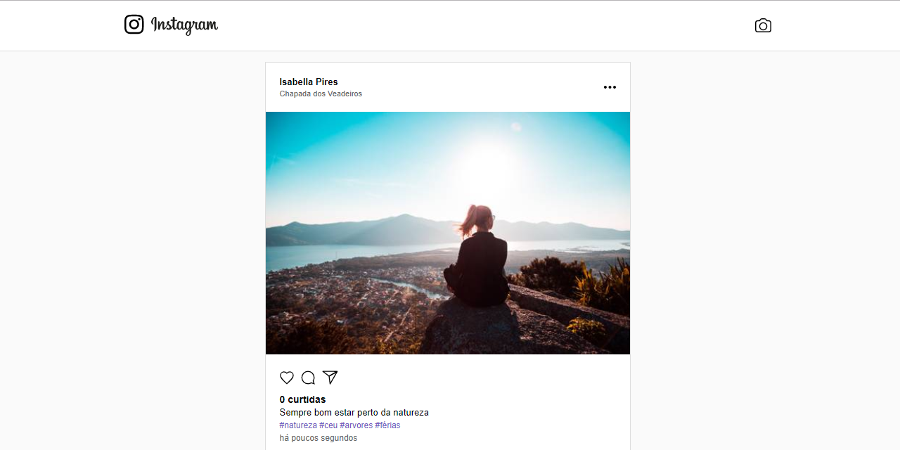

# Instagram Web Clone


<br></br>

## API

It's a simple instagram's like application. The user can upload a photo with a description, location and hashtags, others users can see that post and like it as much as they want.

It uses socket.io to make it a real-time application

### Setting up

The only needed setup is a MongoDB url connection in a .env file, then you can run `yarn dev` to run in development mode

## WEB

This project is the a instagram's like web app. Users can post a photo with location, description and hashtags. They can leave as many likes as they want!

### Setting up

1. Enter project directory:

```sh
  cd web_instagram
```

2. Create a `.env` file based on the `.env.example` file and fill in the REACT_APP_API_URL environment variable (it should be `http://localhost:3000`)

3. Install the dependencies:

```sh
  yarn install
```

4. Run in development mode:

```sh
  yarn start
```

> This is a ReactJS project, bootstrapped with [Create React App](https://github.com/facebook/create-react-app)
